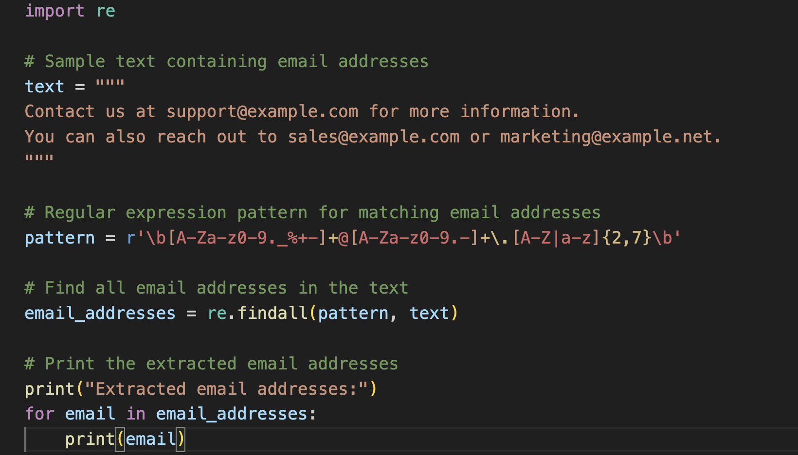

## Regex in Python for dataset building and other things

### This code shows how to use regular expressions in Python to solve a huge variety of tricky text problems, including building datasets from unstructured text!

